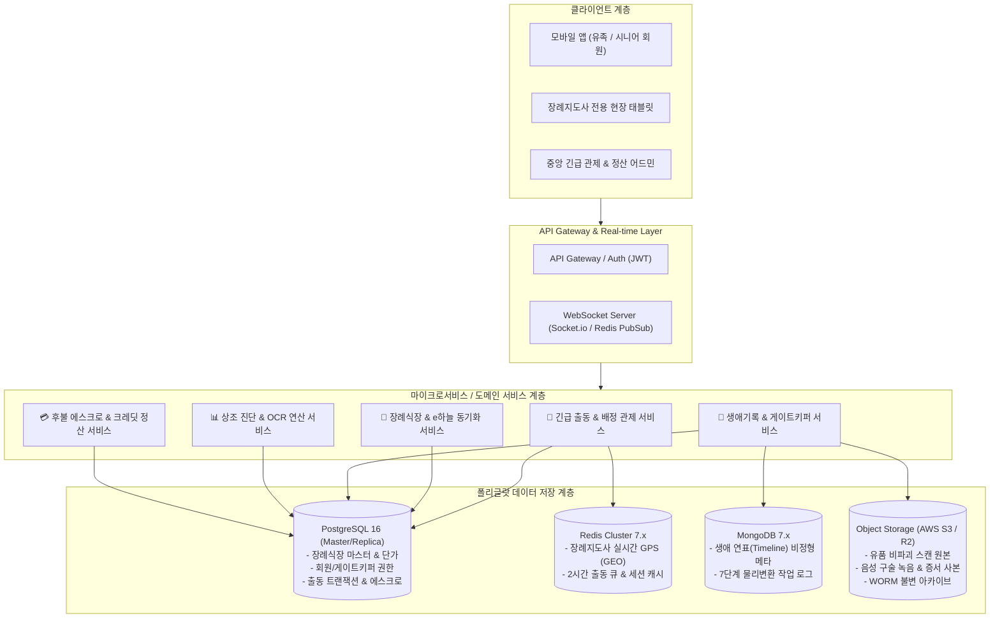
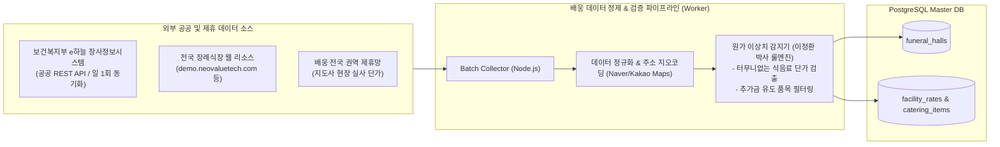

# Backend ERD & Nationwide Funeral Hall DB Architecture Specification
문서 번호: ARCH-2026-002  
상태: Approved (총괄 지휘자 강민석 박사 승인)  
주관: 박현철 박사 (분산 아키텍처) & 이정환 박사 (장례 유통 도메인)  
참여: 배용태 박사 (핀테크 에스크로), 송미란 박사 (기록관리학)

---

## 1. 아키텍처 개요 및 폴리글랏 영속성 전략 (Polyglot Persistence)

'배웅(Bae-ung)' 플랫폼은 **초저지연 긴급 출동 관제**, **공공 API 기반 전국 장례식장 데이터 레이크**, **금융급 후불 에스크로 정산**, **WORM(Write-Once-Read-Many) 비파괴 생애기록 보존**을 동시에 만족해야 하므로 폴리글랏 데이터 아키텍처를 채택한다.



---

## 2. 5대 Bounded Context 도메인 모델링 (DDD)

1. **Facility Context (장례식장 및 시설/단가)**:
   - 보건복지부 e하늘 연계 전국 1,200여 개소 장례식장 인프라.
   - 빈소 평수별 시간/일일 임대료, 안치료, 염습실, 식음료 정찰가 및 배웅 제휴 감면율.
2. **Emergency Dispatch Context (긴급 출동 및 배정 관제)**:
   - 24시간 긴급 접수(고인 위치, 이송 희망 식장, 상주 연락처).
   - 공인 장례지도사 2시간 이내 현장 급파, 실시간 GPS 경로 추적 및 ETA 관제.
3. **Memorial & Living Archive Context (생애기록관 & 게이트키퍼)**:
   - 3단계 구독(Storage / Organization / Companionship).
   - 생애 연표(Timeline), 7단계 물리적 유품 디지털화(비파괴 스캔, 검수, 반환).
   - 사망 확인 게이트키퍼(사망진단서, 유산관리자 키) 및 사후 5대 분기 처리.
4. **Package & Diagnostic Context (정찰 패키지 & 견적 진단)**:
   - 무빈소(190만), 실속형(250만), 표준형(310만) 정찰제 BOM(Bill of Materials).
   - 상조 증서 OCR 인식 데이터 및 공정위 기준 해약환급금 진단 스냅샷.
5. **Settlement & Escrow Context (후불 에스크로 & 손실 보전 크레딧)**:
   - 선불금 0원, 장례 완료 후 최종 실비 대조 정산.
   - 상조 해약 손실 보전 크레딧 바우처 차감 및 촌지 적발 시 100% 환불 감사 로깅.

---

## 3. 통합 관계형 데이터베이스(ERD) 상세 설계 (PostgreSQL)

```mermaid
erDiagram
    users ||--o{ member_profiles : has
    users ||--o{ subscriptions : subscribes
    users ||--o{ emergency_dispatches : requests
    users ||--o{ gatekeeper_policies : configures
    gatekeeper_policies ||--o{ designated_trustees : assigns
    
    funeral_halls ||--o{ altar_rooms : contains
    funeral_halls ||--o{ facility_rates : defines
    funeral_halls ||--o{ catering_items : provides
    
    emergency_dispatches ||--o| dispatch_assignments : assigned_to
    funeral_directors ||--o{ dispatch_assignments : executes
    funeral_halls ||--o{ emergency_dispatches : destination
    
    users ||--o{ quote_diagnoses : analyzes
    
    emergency_dispatches ||--o| funeral_orders : generates
    funeral_packages ||--o{ funeral_orders : selected_package
    funeral_packages ||--o{ package_items : consists_of
    
    funeral_orders ||--|| escrow_settlements : settles
    users ||--o{ transition_credits : owns
    transition_credits ||--o{ credit_usages : consumed_in
    escrow_settlements ||--o{ credit_usages : applies

    users {
        uuid id PK
        varchar phone UK
        varchar name
        varchar role "USER, DIRECTOR, ADMIN"
        timestamp created_at
    }

    funeral_halls {
        uuid id PK
        varchar ehaneul_id UK "e하늘 시스템 식별자"
        varchar name "장례식장명"
        varchar region_code "시도/시군구 코드"
        varchar address
        float latitude
        float longitude
        int total_rooms "총 빈소 수"
        int mortuary_capacity "안치실 수용능력"
        boolean is_partner "배웅 제휴 협약 여부"
        decimal partner_discount_rate "빈소 임대료 제휴 할인율"
        timestamp updated_at
    }

    altar_rooms {
        uuid id PK
        uuid funeral_hall_id FK
        varchar room_name "빈소 명칭(예: 특실 1호)"
        decimal room_size_pyeong "평수"
        decimal hourly_rate "시간당 임대료"
        decimal daily_rate "1일 임대료"
        boolean is_available
    }

    facility_rates {
        uuid id PK
        uuid funeral_hall_id FK
        varchar item_type "MORTUARY(안치료), EMBALMING(염습실), CLEANING(소독)"
        decimal unit_price
        varchar billing_unit "HOUR, DAY, ONCE"
    }

    catering_items {
        uuid id PK
        uuid funeral_hall_id FK
        varchar item_name "식음료명 (밥, 육개장, 수육 등)"
        varchar category "MEAL, SIDE, BEVERAGE"
        decimal unit_price
        timestamp verified_at "원가 검증 일자"
    }

    funeral_directors {
        uuid id PK
        uuid user_id FK
        varchar license_no UK "국가공인 장례지도사 자격번호"
        varchar assigned_region "전담 관할 권역"
        varchar current_status "AVAILABLE, ON_DUTY, OFF_DUTY"
        float current_lat "실시간 위도"
        float current_lng "실시간 경도"
        decimal rating_avg "유족 평점 평균"
        int completed_cases "누적 의전 건수"
    }

    emergency_dispatches {
        uuid id PK
        uuid requester_user_id FK
        varchar deceased_location "고인 위치 (병원/자택/요양원)"
        float deceased_lat
        float deceased_lng
        uuid target_funeral_hall_id FK
        varchar status "PENDING, ASSIGNED, EN_ROUTE, ARRIVED, COMPLETED, CANCELLED"
        timestamp requested_at
        timestamp assigned_at
        timestamp arrived_at
    }

    dispatch_assignments {
        uuid id PK
        uuid dispatch_id FK
        uuid director_id FK
        int estimated_arrival_minutes "예상 도착 소요시간(ETA)"
        timestamp departed_at
        text live_gps_route_json
    }

    funeral_packages {
        uuid id PK
        varchar package_code UK "NO_ALTAR(무빈소), PRACTICAL(실속), STANDARD(표준)"
        varchar package_name
        decimal fixed_price "정찰 패키지 가격 (190만/250만/310만)"
        text description
    }

    package_items {
        uuid id PK
        uuid package_id FK
        varchar category "SHROUD(수의), CASKET(관), FLORAL(꽃장식), VEHICLE(차량), STAFF(인력)"
        varchar item_name
        varchar origin "국산 100%, 중국산 등 원산지 투명 공개"
        decimal wholesale_cost "도매 실비 원가"
        decimal retail_price "정찰제 공급가"
        boolean is_mandatory
    }

    funeral_orders {
        uuid id PK
        uuid dispatch_id FK
        uuid package_id FK
        decimal total_facility_fee "장례식장 시설비"
        decimal total_catering_fee "식음료 실비"
        decimal total_package_fee "배웅 패키지 정찰가"
        decimal total_credit_discount "전환 크레딧 차감액"
        decimal final_settlement_amount "최종 실비 정산 총액"
        varchar status "IN_PROGRESS, AUDITED, SETTLED"
    }

    escrow_settlements {
        uuid id PK
        uuid order_id FK
        varchar escrow_account_no
        varchar payment_method "CARD, TRANSFER, VIRTUAL_ACCOUNT"
        decimal paid_amount
        boolean gratuity_violation_reported "촌지 요구 신고 여부"
        decimal refund_amount "촌지 적발 시 환불액"
        timestamp settled_at
    }

    gatekeeper_policies {
        uuid id PK
        uuid user_id FK
        varchar death_verification_status "ALIVE, VERIFYING, CONFIRMED"
        timestamp death_confirmed_at
        varchar document_verification_url "공인 사망진단서 S3 경로"
        varchar default_post_action "DESIGNATED, MEMORIAL, PRIVATE, DONATION, DELETE"
    }

    designated_trustees {
        uuid id PK
        uuid policy_id FK
        int priority "1: 1순위, 2: 2순위"
        varchar trustee_name
        varchar trustee_phone
        varchar access_key_hash "유산관리자 인증 보안키 해시"
        boolean has_access_granted
    }

    transition_credits {
        uuid id PK
        uuid user_id FK
        varchar source_competitor "기존 상조사명"
        decimal original_loss_amount "해약 손실액"
        decimal issued_credit_amount "보전 크레딧 발행액"
        decimal remaining_credit_amount "잔여 크레딧"
        date expires_at
    }

    credit_usages {
        uuid id PK
        uuid credit_id FK
        uuid order_id FK
        decimal used_amount
        timestamp used_at
    }
```



---

## 4. 생애기록관 NoSQL 문서 스키마 (MongoDB Collection: `archive_timelines`)

생애 연표와 유품 비파괴 변환 7단계 작업 로그는 비정형성과 스키마 확장성을 위해 문서 지향 모델로 격리 관리한다.

```json
{
  "_id": "ObjectId('65f3a1b2c3d4e5f6a7b8c9d0')",
  "userId": "uuid-hong-gildong-001",
  "timelineYear": 1995,
  "category": "RELIC_OBJECT", // DIARY, AWARD, BOOK, PHOTO, RELIC_OBJECT, INTERVIEW
  "title": "30년 근속 기념 수동 필름카메라",
  "significanceStory": "평생을 바친 정밀 기계 공정에서 기술 명장으로 선정되었을 때 회사에서 수여받은 유품. 나의 땀과 열정이 담긴 가장 아끼는 물건.",
  "mediaAssets": [
    {
      "assetType": "IMAGE_3D_SCAN",
      "s3Key": "archives/hong/1995/camera_mesh.obj",
      "s3ThumbnailUrl": "https://cdn.bae-ung.com/thumbnails/camera_thumb.webp",
      "sha256Hash": "e3b0c44298fc1c149afbf4c8996fb92427ae41e4649b934ca495991b7852b855",
      "isEncrypted": true
    },
    {
      "assetType": "AUDIO_INTERVIEW",
      "s3Key": "archives/hong/1995/oral_interview_01.m4a",
      "durationSeconds": 135,
      "transcriptText": "이 카메라 렌즈를 볼 때마다 그 시절 밤샘 작업하던 동료들의 얼굴이 떠오릅니다..."
    }
  ],
  "physicalWorkflow": {
    "workflowStatus": "ORIGINAL_RETURNED", // 7단계: SELECTED -> PHOTO_LOGGED -> RECEIVED -> NON_DESTRUCTIVE_SCANNED -> QC_PASSED -> APPROVED -> ORIGINAL_RETURNED
    "stepLogs": [
      { "step": 1, "name": "대상 선정", "completedAt": "2026-10-05T10:00:00Z" },
      { "step": 2, "name": "사전 상태 기록", "photos": ["pre_inspect_01.jpg"], "completedAt": "2026-10-05T10:30:00Z" },
      { "step": 3, "name": "방문 수거", "collectorStaffId": "staff-007", "completedAt": "2026-10-05T14:00:00Z" },
      { "step": 4, "name": "비파괴 고해상도 3D 스캔", "operatorTimeSeconds": 1850, "completedAt": "2026-10-06T11:00:00Z" },
      { "step": 5, "name": "품질 검수(QC)", "inspector": "송미란_박사_팀", "completedAt": "2026-10-06T15:00:00Z" },
      { "step": 6, "name": "고객 최종 승인", "signatureMethod": "MOBILE_SIGN", "completedAt": "2026-10-07T09:00:00Z" },
      { "step": 7, "name": "원본 실물 반환", "receiptConfirmationUrl": "s3://contracts/hong_return_receipt.pdf", "completedAt": "2026-10-07T16:00:00Z" }
    ],
    "billableLaborMinutes": 45 // 1회성 실비 인건비 정산 데이터
  },
  "postMortemPrivacy": {
    "action": "MEMORIAL_PUBLIC", // DESIGNATED_ONLY, MEMORIAL_PUBLIC, PRIVATE_RESERVE, INSTITUTION_DONATION, PERMANENT_DELETE
    "allowedAudience": ["FAMILY", "MEMORIAL_VISITORS"],
    "requiresGatekeeperVerification": true
  },
  "createdAt": "2026-10-05T09:00:00Z",
  "updatedAt": "2026-10-07T16:00:00Z"
}
```

---

## 5. 전국 장례식장 e하늘 공공 API 연동 및 데이터 파이프라인



---

## 6. PostgreSQL 프로덕션 DDL 스크립트

```sql
-- 배웅 플랫폼 프로덕션 DDL (Core Schemas)
CREATE EXTENSION IF NOT EXISTS "uuid-ossp";
CREATE EXTENSION IF NOT EXISTS "postgis";

-- 1. 전국 장례식장 마스터 테이블
CREATE TABLE funeral_halls (
    id UUID PRIMARY KEY DEFAULT uuid_generate_v4(),
    ehaneul_id VARCHAR(50) UNIQUE,
    name VARCHAR(100) NOT NULL,
    region_code VARCHAR(10) NOT NULL,
    address TEXT NOT NULL,
    geom GEOMETRY(Point, 4326) NOT NULL,
    total_rooms INT DEFAULT 0,
    mortuary_capacity INT DEFAULT 0,
    is_partner BOOLEAN DEFAULT FALSE,
    partner_discount_rate NUMERIC(5, 2) DEFAULT 0.00,
    created_at TIMESTAMP WITH TIME ZONE DEFAULT CURRENT_TIMESTAMP,
    updated_at TIMESTAMP WITH TIME ZONE DEFAULT CURRENT_TIMESTAMP
);

CREATE INDEX idx_funeral_halls_geom ON funeral_halls USING GIST(geom);
CREATE INDEX idx_funeral_halls_region ON funeral_halls(region_code);

-- 2. 장례지도사 마스터 테이블
CREATE TABLE funeral_directors (
    id UUID PRIMARY KEY DEFAULT uuid_generate_v4(),
    user_id UUID NOT NULL,
    license_no VARCHAR(50) UNIQUE NOT NULL,
    assigned_region VARCHAR(20) NOT NULL,
    current_status VARCHAR(20) DEFAULT 'AVAILABLE',
    current_location GEOMETRY(Point, 4326),
    rating_avg NUMERIC(3, 2) DEFAULT 5.00,
    completed_cases INT DEFAULT 0,
    created_at TIMESTAMP WITH TIME ZONE DEFAULT CURRENT_TIMESTAMP
);

CREATE INDEX idx_directors_location ON funeral_directors USING GIST(current_location);

-- 3. 긴급 출동 요청 테이블
CREATE TABLE emergency_dispatches (
    id UUID PRIMARY KEY DEFAULT uuid_generate_v4(),
    requester_user_id UUID NOT NULL,
    deceased_location_desc TEXT NOT NULL,
    deceased_geom GEOMETRY(Point, 4326) NOT NULL,
    target_funeral_hall_id UUID REFERENCES funeral_halls(id),
    status VARCHAR(20) DEFAULT 'PENDING',
    requested_at TIMESTAMP WITH TIME ZONE DEFAULT CURRENT_TIMESTAMP,
    assigned_at TIMESTAMP WITH TIME ZONE,
    arrived_at TIMESTAMP WITH TIME ZONE
);

CREATE INDEX idx_emergency_dispatches_status ON emergency_dispatches(status);

-- 4. 후불 에스크로 정산 테이블
CREATE TABLE escrow_settlements (
    id UUID PRIMARY KEY DEFAULT uuid_generate_v4(),
    order_id UUID UNIQUE NOT NULL,
    escrow_account_no VARCHAR(50) NOT NULL,
    payment_method VARCHAR(30) NOT NULL,
    paid_amount NUMERIC(12, 2) NOT NULL,
    gratuity_violation_reported BOOLEAN DEFAULT FALSE,
    refund_amount NUMERIC(12, 2) DEFAULT 0.00,
    settled_at TIMESTAMP WITH TIME ZONE
);
```

---

## 7. 검토 및 승인 서명
- **총괄 지휘자**: 강민석 박사 (Approved on 2026-09-26)  
- **분산 아키텍처 주관**: 박현철 박사 (Verified HA & WORM Storage Policy)  
- **장례 유통 도메인 주관**: 이정환 박사 (Verified e-Haneul Schema & Rate Models)
