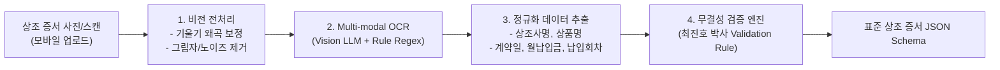
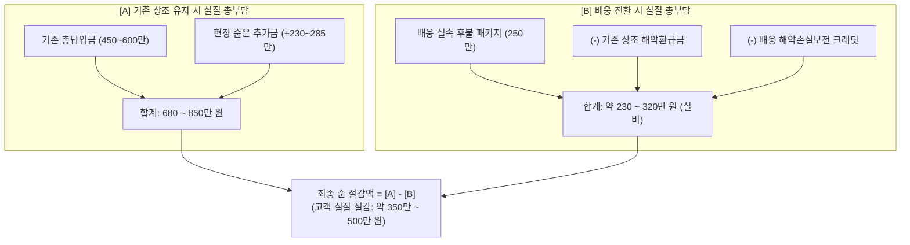

# Quote Diagnostics & OCR Calculation Engine Specification
문서 번호: ALGO-2026-003  
상태: Approved (총괄 지휘자 강민석 박사 승인)  
주관: 최진호 박사 (AI 비전 & 시뮬레이션) & 배용태 박사 (회계/핀테크 정산)  
참여: 조은영 박사 (공정위 표준약관 법제 감수), 한수진 박사 (영수증 대조 UX 감수)

---

## 1. 개요 및 설계 목적

기존 대형 선불식 상조회사의 불투명한 유통 마진과 현장 추가금 구조를 타파하기 위해, 고객이 보유한 상조 계약 증서를 모바일 카메라로 촬영(Vision OCR)하면:
1. **공정거래위원회 고시 법정 해약환급금**을 1원 단위까지 정밀 산출하고,
2. 통계적 데이터 기반의 **현장 숨은 추가금(수의·꽃장식·촌지 등)**을 자동 추정하며,
3. 배웅의 실비 패키지 및 **해약 손실 보전 크레딧**을 결합하여,
4. **최종 순 절감액(Net Savings)**을 **1:1 맞춤 영수증 비교표**로 즉각 렌더링하는 엔드투엔드 알고리즘 엔진을 정의한다.

---

## 2. 상조 계약 증서 Vision OCR 데이터 추출 파이프라인



### 증서 인식 표준 JSON 출력 스키마 (`CertificateExtractionSchema`)
```typescript
export interface CertificateExtractionSchema {
  certificateId: string;
  recognizedAt: string;
  competitorName: string;            // 예: "B상조", "P상조", "H상조"
  productName: string;               // 예: "프리미엄 450", "늘푸른 590"
  contractDate: string;              // "YYYY-MM-DD"
  totalContractAmount: number;       // 총 계약금 (원, 예: 4,500,000)
  monthlyPayment: number;            // 월 납입금 (원, 예: 30,000)
  totalInstallments: number;         // 총 약정 납입 회차 (예: 150)
  paidInstallments: number;          // 현재 실 납입 회차 (예: 42)
  paidTotalAmount: number;           // 실 납입 누계액 (원, 예: 1,260,000)
  remainingAmount: number;           // 잔여 납입 예정액 (원, 예: 3,240,000)
  hasMaturityRefund100: boolean;     // 만기 시 100% 환급 특약 여부
  confidenceScore: number;           // OCR 신뢰도 (0.00 ~ 1.00)
}
```

---

## 3. 공정거래위원회 고시 기준 법정 해약환급금 산정 수식

공정거래위원회 고시 제2020-1호 **「선불식 할부계약의 해약환급금 산정기준」** 표준 산식을 엔진에 완전 코드화한다.

$$R(n) = \begin{cases} 
0, & 1 \le n \le n_{cutoff} \\
(P \times n) - M_{deduct} - C_{deduct}, & n_{cutoff} < n < N \\
(P \times N) \times R_{maturity}, & n = N \text{ (만기)}
\end{cases}$$

- $P$: 월 납입금 (Monthly Payment)
- $n$: 실 납입 회차 (Paid Installments)
- $N$: 총 약정 납입 회차 (Total Installments)
- $M_{deduct}$: 모집수수료 공제액 (공정위 고시: 계약 체결 후 1년 이내 해약 시 납입금의 최대 일정비율 차감)
- $R_{maturity}$: 만기 시 법정 환급률 (일반형 85%, 만기 100% 환급 결합상품의 경우 약정 확인)

```typescript
export class StatutoryRefundCalculator {
  /**
   * 공정위 고시 기준 상조 해약환급금 계산기
   */
  public static calculateRefund(cert: CertificateExtractionSchema): {
    refundAmount: number;
    refundRatePercentage: number;
    lossAmount: number;
  } {
    const { paidInstallments, totalInstallments, paidTotalAmount, totalContractAmount } = cert;
    
    // 1. 극초기 (1~3회차): 모집수수료 공제로 환급금 0원 구간
    if (paidInstallments <= 3) {
      return { refundAmount: 0, refundRatePercentage: 0, lossAmount: paidTotalAmount };
    }

    // 2. 만기 도달 시
    if (paidInstallments >= totalInstallments) {
      const maturityRate = cert.hasMaturityRefund100 ? 1.00 : 0.85;
      const refundAmount = Math.floor(paidTotalAmount * maturityRate);
      return {
        refundAmount,
        refundRatePercentage: maturityRate * 100,
        lossAmount: paidTotalAmount - refundAmount
      };
    }

    // 3. 중도 해약 시 공정위 표준 체증 환급률 곡선
    // Progress Ratio (납입 진행률)
    const progress = paidInstallments / totalInstallments;
    let statutoryRate = 0;

    if (progress < 0.20) {
      statutoryRate = 0.50 * (progress / 0.20); // 0% -> 50% 선형 증가
    } else if (progress < 0.50) {
      statutoryRate = 0.50 + 0.25 * ((progress - 0.20) / 0.30); // 50% -> 75%
    } else {
      statutoryRate = 0.75 + 0.10 * ((progress - 0.50) / 0.50); // 75% -> 85%
    }

    const refundAmount = Math.floor(paidTotalAmount * statutoryRate);
    const lossAmount = paidTotalAmount - refundAmount;

    return {
      refundAmount,
      refundRatePercentage: Math.round(statutoryRate * 1000) / 10,
      lossAmount
    };
  }
}
```

---

## 4. 현장 숨은 추가금(Hidden Add-on Costs) 추정 엔진

실제 장례식장 현장에서 기존 상조회사가 유가족의 경황없는 심리를 이용하여 유도하는 추가금 평균 통계치(이정환 박사 실태조사 데이터)를 알고리즘에 반영한다.

$$\text{Total Hidden Cost} = C_{shroud\_upgrade} + C_{flower\_upgrade} + C_{distance\_over} + C_{tip\_gratuity}$$

| 항목 | 통계적 최소 추가금 | 통계적 평균 추가금 | 통계적 최대 추가금 | 배웅의 방지 장치 |
| :--- | :--- | :--- | :--- | :--- |
| **수의·관 등급 업셀링** | +1,000,000원 | **+1,500,000원** | +2,500,000원 | 원산지 100% 정찰제 포함 |
| **제단 꽃장식 확대** | +500,000원 | **+800,000원** | +1,500,000원 | 도매 화훼 직거래망 정찰제 |
| **차량 초과 거리 요금** | +200,000원 | **+350,000원** | +600,000원 | 사전 거리 기반 정찰 요금 |
| **지도사/도우미 수고비(촌지)**| +100,000원 | **+200,000원** | +400,000원 | 촌지 전면 금지 / 100% 환불 |
| **합계 (평균 추가금)** | **+1,800,000원** | **+2,850,000원** | **+5,000,000원** | **추가금 0원 보증** |

---

## 5. 최종 순 절감액(Net Savings) 산출 로직



### 손익 비교 수식 모델
1. **기존 상조 유지 시 총 지출액**:
   $$E_{competitor} = \text{ContractTotal} + \text{EstimatedHiddenCost}$$
2. **배웅 전환 시 총 지출액**:
   $$E_{baeung} = \text{BaeungPackagePrice} - \text{RefundAmount} - \text{TransitionCredit}$$
   *(단, 전환 크레딧 $TransitionCredit = \min(\text{LossAmount} \times 0.30, 500,000\text{원})$)*
3. **최종 순 절감액 (Net Savings)**:
   $$\text{NetSavings} = E_{competitor} - E_{baeung}$$

---

## 6. 1:1 맞춤 영수증 좌우 대조 렌더링 Spec

```json
{
  "diagnosticId": "diag-2026-0926-001",
  "clientName": "김철수",
  "analyzedAt": "2026-09-26T22:30:00Z",
  "leftSideCompetitorReceipt": {
    "title": "기존 A상조 유지 시 예상 총지출",
    "lineItems": [
      { "name": "기존 상조 약정 총액", "amount": 4500000 },
      { "name": "현장 수의/관 업셀링 예상", "amount": 1500000, "isWarning": true },
      { "name": "제단 꽃장식 추가금 예상", "amount": 800000, "isWarning": true },
      { "name": "운구차량 초과 및 촌지 관행", "amount": 400000, "isWarning": true }
    ],
    "totalExpectedExpense": 7200000
  },
  "rightSideBaeungReceipt": {
    "title": "배웅 후불제 전환 시 실제 부담액",
    "lineItems": [
      { "name": "배웅 실속 3일장 정찰 패키지", "amount": 2500000 },
      { "name": "기존 상조 해약환급금 수령액 (차감)", "amount": -1440000, "isDeduction": true },
      { "name": "배웅 해약손실 보전 크레딧 (차감)", "amount": -300000, "isDeduction": true },
      { "name": "현장 추가금 및 촌지", "amount": 0, "isHighlighted": true }
    ],
    "totalActualExpense": 760000
  },
  "summary": {
    "netSavingsAmount": 6440000,
    "savingsRatePercentage": 89.4,
    "callToActionBadge": "배웅 전환 시 총 6,440,000원이 절감됩니다!"
  }
}
```

---

## 7. 검토 및 승인 서명
- **총괄 지휘자**: 강민석 박사 (Approved on 2026-09-26)  
- **AI 비전/시뮬레이션 주관**: 최진호 박사 (Algorithm Verification Passed)  
- **핀테크 회계 주관**: 배용태 박사 (Statutory Refund & Credit Balance Audited)  
- **공정위 표준약관 법제 감수**: 조은영 박사 (Legal Compliance Passed)
