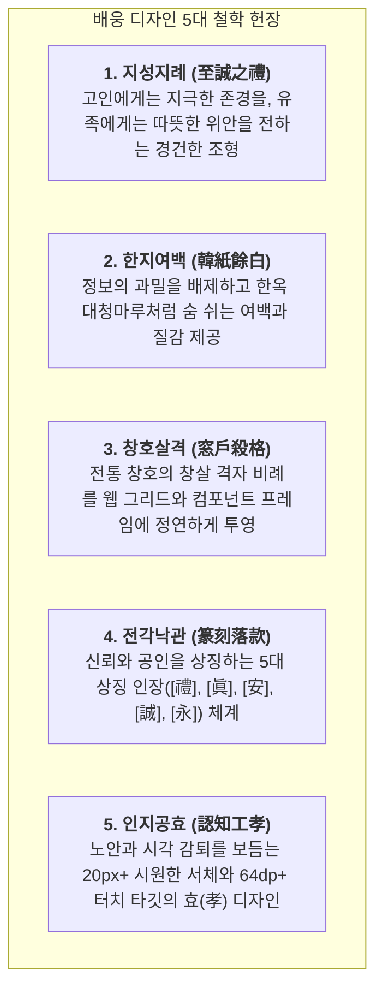

# 배웅(Bae-ung) 디자인 철학 헌장: 한국 전통 미학과 모던 정갈함의 조화
문서 번호: AREA-CHARTER-2026-008  
발효 일자: 2026-09-26  
제정자: **조성우 수석 디자이너 (34년 경력, 한국전통시각디자인연구원장, 전 국립현대미술관·KCDF 시각 총괄 자문)**  
기술 구현: **강민석 총괄 아키텍트 & 시니어 디자인 시스템 엔지니어링 팀**  
승인: 이정환 박사 (상장례 예법), 한수진 박사 (시니어 인지공학), 최진호 박사 (금융소비자보호)

---

## 1. 헌장 서문 (Preamble)

> *"장례(葬禮)는 삶의 마지막 마침표이자, 한 인간이 온 생애에 걸쳐 빚어낸 고결한 궤적을 세상에 남기는 가장 숭고한 봉헌의 의례이다.*  
> *배웅의 디자인은 화려한 치장이나 천박한 상업적 판촉을 거부한다.  
> 천 년을 숨 쉬어 온 닥종이 한지(韓紙)의 온화함, 절제된 선비의 묵빛(墨色), 고궁 처마와 단청의 비취록(翡翠綠), 그리고 왕실 제기와 유기의 기품 있는 황동금(鍮器金)이 어우러진  
> **'한국 전통의 숭고한 예(禮)'와 '현대적 극상의 정갈함(Cleanliness)'의 합일(合一)**을 지향한다.*  
> *우리는 50대부터 90대까지의 고령 유족이 슬픔 속에서도 시각적 편안함과 절대적 신뢰를 느낄 수 있는 시니어 배려의 조형 환경을 완성한다."*  
> — 조성우 수석 디자이너

---

## 2. 5대 핵심 디자인 철학 기둥 (5 Pillars of Baeung Aesthetics)

### 기둥 1. 지성지례 (至誠之禮 — Sincere Reverence)
- 모든 시각 요소는 가벼운 상업용 웹사이트의 번쩍거림(Bling-bling)이나 애니메이션 과잉을 배제한다.
- 타이포그래피는 붓의 결이 살아 있는 `Noto Serif KR` 명조체를 골간으로 삼아, 장중하고 정중한 어조를 유지한다.

### 기둥 2. 한지여백 (韓紙餘白 — Breathing Space & Hanji Texture)
- 배경은 차가운 청백색 형광등 모니터 색을 엄격히 금지하고, 전통 닥종이의 따스한 미색 `#FAF8F5`를 기조로 삼는다.
- 컨텐츠 카드 간 여백(Spacing)은 일반 상용 웹 대비 1.5배 이상 넉넉하게 확보하여 시각 피로를 해소한다.

### 기둥 3. 창호살격 (窓戶殺格 — Grille Proportion & Bracket Frames)
- 카드의 모서리마다 고서(古書)와 조선 왕실 의궤를 감싸던 황동 귀접이 장식(`k-corner-bracket`)을 두어, 문서 하나하나가 공인된 정례 서식임을 알린다.
- 옅은 미색 테두리(`border-ink-border`)와 창호지 살창 텍스처(`k-changho-texture`)로 정갈함을 극대화한다.

### 기둥 4. 전각낙관 (篆刻落款 — Seal of Trust)
- 5대 핵심 서비스의 영문 약자나 모호한 아이콘 대신, 선조들의 서화에 찍히던 붉은 인주와 금박의 전통 전각 낙관을 각인한다.
  - **`[禮]` (예도 례)**: 종합 의전 안내 — 최고의 품격과 예우
  - **`[眞]` (참 진)**: 상조 견적 진단 — 거짓 없는 100% 원가 공개
  - **`[安]` (편안할 안)**: 전국 장례식장 — 고인의 편안한 영구 안식
  - **`[誠]` (정성 성)**: 정찰제 패키지 — 처음부터 끝까지 변함없는 정성
  - **`[永]` (길 영)**: 생애기록관 — 영원히 잊히지 않을 존엄한 기억

### 기둥 5. 인지공효 (認知工孝 — Gerontological UX)
- 돋보기를 쓰지 않아도 한눈에 읽히는 본문 18~20px, 헤드라인 24~34px 기준선.
- 우측 상단 '글씨 확대' 클릭 시 브라우저 루트 레벨에서 전체 요소가 122%~125% 즉각 확장.
- 손떨림이나 조작 미숙을 고려한 64dp 이상의 안전 터치 영역 및 모바일 화면 하단 상시 고정 24시 긴급 핫라인 독.

---

## 3. 디자인 토큰 및 개발 명세 (Design Tokens Specification)

| 토큰 구분 | 토큰 키 | 값 | 문화적 의미 및 용도 |
| :--- | :--- | :--- | :--- |
| **Color: Background** | `color.bg.hanji` | `#FAF8F5` | 한지 미색 (기본 배경) |
| **Color: Surface** | `color.surface.porcelain` | `#FFFFFF` | 백자 순백 (카드 배경) |
| **Color: Text Primary** | `color.text.deepInk` | `#1F2226` | 진먹색 (명도 대비 최고 텍스트) |
| **Color: Text Muted** | `color.text.mutedInk` | `#6C757D` | 은은한 먹빛 (보조 설명) |
| **Color: Signature** | `color.brand.celadonDark` | `#243F35` | 단청 비취록 (신뢰와 경건) |
| **Color: Noble Accent** | `color.accent.nobleGold` | `#94784C` | 고려 황동금 (품격과 예우) |
| **Color: Emergency** | `color.alert.crimsonDeep` | `#A33B32` | 전통 인주홍 (24시 긴급 출동) |
| **Typography: Serif** | `font.reverence` | `'Noto Serif KR', serif` | 헤드라인, 낙관, 주요 수치 |
| **Typography: Sans** | `font.sans` | `'Pretendard Variable', sans-serif` | 본문, 폼 컨트롤, 데이터 라벨 |
| **Touch Target** | `size.touchTarget.senior` | `64px` | 시니어 최소 터치 높이 |
| **Radius** | `radius.card` | `24px` (rounded-3xl) | 전통 도자기의 완만한 곡선 |

---

## 4. 기술 구현 위원회 서명
- **디자인 철학 제정**: 조성우 수석 디자이너 (한국전통시각디자인연구원장, 34년)
- **개발 환경 구축**: 강민석 총괄 아키텍트 (시니어 프론트엔드 엔지니어링 팀)
- **시니어 인지공학 검수**: 한수진 박사
- **상장례 예법 검수**: 이정환 박사
