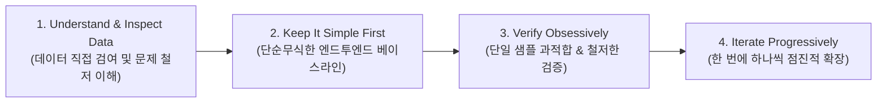

# Andrej Karpathy의 엔지니어링 4대 원칙 (SeeOut 적용 가이드)
문서 번호: AREA-RULE-2026-004  
상태: Active  
주관: 안드레 카파시 원칙 수호 위원회 & Themis-AI 거버넌스  

---

## 🏛️ 원칙 개요

안드레 카파시(Andrej Karpathy)가 제창한 엔지니어링 및 소프트웨어 구축 철학은 복잡한 시스템 개발 시 발생하는 조기 최적화, 가정에 기반한 버그, 과도한 복잡성을 방지하고 확실한 작동성을 담보하기 위한 4대 절대 규칙입니다.

---

## 📌 4대 원칙 세부 실천 지침

### 1원칙. 데이터와 문제를 철저하게 직접 들여다보라 (Understand the Problem & Inspect the Data Thoroughly)
- **지침**: 코드를 작성하기 전에 소스 데이터(e하늘 장사정보, 구글 독스 1,060개 장례식장 원문, 상조 증서 등)를 직접 끝까지 읽고, 데이터의 분포, 결측치, 이상치, 특이 케이스를 파악한다.
- **금지**: 데이터 스키마를 상상이나 추측으로 먼저 정의하지 않는다.

### 2원칙. 가장 단순하고 명료한 베이스라인부터 시작하라 (Start with a Simple, Dumb Baseline First)
- **지침**: 불필요한 추상화나 과도한 라이브러리 도입을 지양하고, 입력부터 출력까지 가장 단순한 형태(Minimal Viable Baseline)로 데이터가 관통하는 파이프라인을 먼저 만든다.
- **금지**: 처음부터 복잡한 분산 큐나 분산 캐시 등 과도한 아키텍처를 도입하지 않는다.

### 3원칙. 집요하게 검증하고 단일 배치부터 테스트하라 (Verify Obsessively & Overfit a Single Batch)
- **지침**: 전체 데이터를 다루기 전에 1~3개의 구체적인 샘플(예: 서울아산병원, 시민장례식장 등)에 대해 1원 단위, 필드 단위까지 정확히 파싱되고 계산되는지 단위 테스트와 입출력 단언(assertions)으로 100% 입증한다.
- **금지**: 테스트되지 않은 코드를 '돌아가겠지'라는 낙관적 기대로 다음 단계로 넘기지 않는다.

### 4원칙. 한 번에 하나씩 격리하여 점진적으로 확장하라 (Iterate and Generalize Progressively)
- **지침**: 한 번의 스텝에서 단 한 가지 가설/변수/기능만 변경하고, 이전 베이스라인과 결과를 비교 검증하며 확장한다.
- **금지**: 여러 모듈을 동시에 대량으로 바꾸거나 리팩터링하지 않는다.
