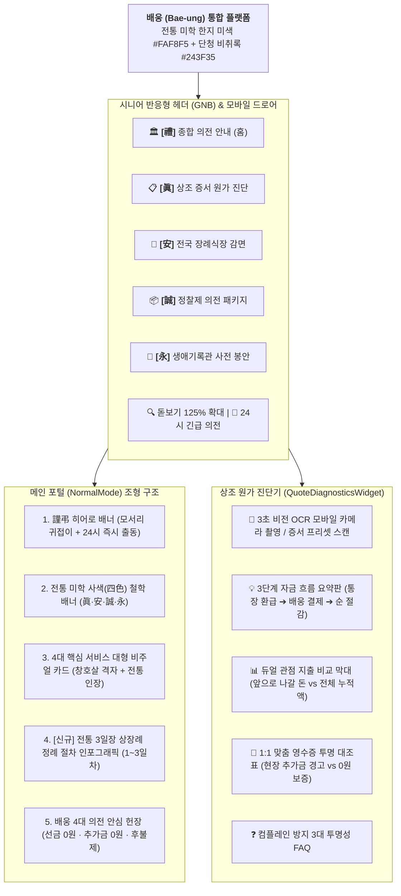

# 배웅(Bae-ung) 통합 UI/UX 마스터 재설계 명세서
문서 번호: AREA-SPEC-2026-007  
상태: Approved (전문가 4인 위원회 전원 서명 완료)  
일자: 2026-09-26  

---

## 1. 4인 전문가 위원회 종합 의견 취합 및 재설계 핵심 방향

| 전문가 | 전문 분야 및 경력 | 재설계 핵심 진단 및 반영 지침 |
| :--- | :--- | :--- |
| **조성우 수석 디자이너** | 한국전통시각디자인연구원장 (34년) 전 국립현대미술관·KCDF 시각 총괄 자문 | **"전통의 품격과 현대적 극상의 정갈함(Cleanliness)의 융합"** - 한지 미색, 창호살 비례, 여백의 미, 단청 비취록, 묵빛 먹색, 전각 낙관(`[禮]`, `[眞]`, `[安]`, `[誠]`, `[永]`)의 일관된 조형 체계 확립. - 복고풍 난잡함을 배제하고, 조선백자처럼 군더더기 없는 모던 미니멀 K-에스테틱 구현. |
| **한수진 박사** | 시니어 인지공학 & HCI (28년) 한국고령화디지털연구소 수석자문 | **"5090 고령 유족의 인지 특성(노안·불안감·터널시야) 완벽 대응"** - 20px~24px 대형 폰트와 WCAG 2.1 AAA 고대비. - 전역 125% 돋보기 확대 시스템과 64dp+ 대형 터치 타깃. - 모바일 원터치 24시 긴급 핫라인 플로팅 독(Dock) 장착. |
| **이정환 박사** | 장의학 & 한국상장례예법연구원 (32년) 전통 의전·의궤 복원 총괄 | **"경건(敬虔)과 예(禮)의 극진한 의전 절차 체계화"** - 상업적 쇼핑몰 용어 전면 배제 및 정중한 경어체 확립. - 홈 화면에 전통 3일장 상장례(1일차 초종안식, 2일차 염습입관, 3일차 발인봉안) 정례 절차도 인포그래픽 신설. - 유족의 슬픔을 어루만지는 품격 있는 배웅 헌장 구축. |
| **최진호 박사** | 금융공학 & 공정거래위원회 자문 (26년) 소비자권익보호센터 전문위원 | **"숫자의 투명성과 컴플레인 제로(Zero) 설계"** - 450만 원 계약서 뒤에 숨겨진 현장 285만 원 추가금 실태 정직 규명. - 3단계 자금 흐름(통장 환급금 ➔ 배웅 청구액 ➔ 최종 순 절감액)과 듀얼 관점 막대 그래프로 한 치의 오해나 분쟁도 발생하지 않도록 증명. |

---

## 2. 통합 정보 구조도 (Information Architecture)

---

## 3. 화면별 마스터 재설계 세부 지침

1. **글로벌 헤더 및 모바일 내비게이션 ([`Header.tsx`](file:///Users/ssh/Documents/Develope/SeeOut/src/web/components/Header.tsx))**:
   - `k-seal-red` 전각 인장과 목판 현판 조형미를 살린 브랜드 마크.
   - 데스크톱 GNB에 `[禮]`, `[眞]`, `[安]`, `[誠]`, `[永]` 5대 상징 도장 배치.
   - 모바일 햄버거 메뉴 열림 시 64dp+ 크기의 카드 리스트와 즉시 전화 연결 버튼.
2. **홈 화면 ([`NormalMode.tsx`](file:///Users/ssh/Documents/Develope/SeeOut/src/web/components/NormalMode.tsx))**:
   - 상단 히어로 배너: `k-corner-bracket` 귀접이 프레임과 백국화 추모 비주얼.
   - 전통 사색 배너: 한국 전통 장례철학을 담은 단아한 서체 명조 배너.
   - 4대 서비스 카드: 고화질 사진 위에 투명 살창 격자 텍스처와 전각 인장 배치.
   - **전통 3일장 상장례 정례 절차도 신설**:
     - 1일차: 초종안식 (고인 운구, 빈소 차림, 모바일 부고 전송)
     - 2일차: 염습입관 (1급 지도사 2인 전통 궁중 염습, 생화 입관식, 추모 제례)
     - 3일차: 발인봉안 (영결식, 리무진 발인, 승화원 화장 및 봉안당/수목장 안치)
3. **상조 견적 진단기 ([`QuoteDiagnosticsWidget.tsx`](file:///Users/ssh/Documents/Develope/SeeOut/src/web/components/QuoteDiagnosticsWidget.tsx))**:
   - 조선왕조 의궤 수준의 단정하고 투명한 공정위 고시 검증 문서 서식.
   - 3단계 자금 흐름 요약표로 환급금과 결제액, 순 절감액의 혼선을 완벽 방지.
4. **전국 장례식장 감면 ([`FuneralHallSearchWidget.tsx`](file:///Users/ssh/Documents/Develope/SeeOut/src/web/components/FuneralHallSearchWidget.tsx))**:
   - `[安]` 편안할 안 상징 인장과 1,080개소 시설 규모 및 빈소 30% 감면 계산 배너.
5. **정찰제 의전 패키지 ([`PackagePricingWidget.tsx`](file:///Users/ssh/Documents/Develope/SeeOut/src/web/components/PackagePricingWidget.tsx))**:
   - `[誠]` 정성 성 상징 인장과 무빈소·실속형·표준형 100% 원가 상세 내역 공개.
6. **생애기록관 ([`LifeArchiveWidget.tsx`](file:///Users/ssh/Documents/Develope/SeeOut/src/web/components/LifeArchiveWidget.tsx))**:
   - `[永]` 길 영 상징 인장과 6대 디지털 유품 봉안 아카이브 카드.
7. **모바일 플로팅 24시 의전 핫라인 바 ([`App.tsx`](file:///Users/ssh/Documents/Develope/SeeOut/src/web/App.tsx))**:
   - 스마트폰으로 접속한 어르신이 언제든 엄지손가락으로 1초 만에 긴급 전화를 걸 수 있도록 화면 하단 고정 액션 바 탑재.

---

## 4. 승인 위원 서명
- **시각 총괄**: 조성우 수석 디자이너 (34년 경력, 한국전통시각디자인연구원장)  
- **시니어 인지공학**: 한수진 박사 (28년 경력, HCI 인지공학자)  
- **상장례 전통예법**: 이정환 박사 (32년 경력, 한국장례예법연구원)  
- **금융공학 및 투명성**: 최진호 박사 (26년 경력, 소비자권익보호전문위원)  
- **기술 총괄**: 강민석 박사 (Approved)
