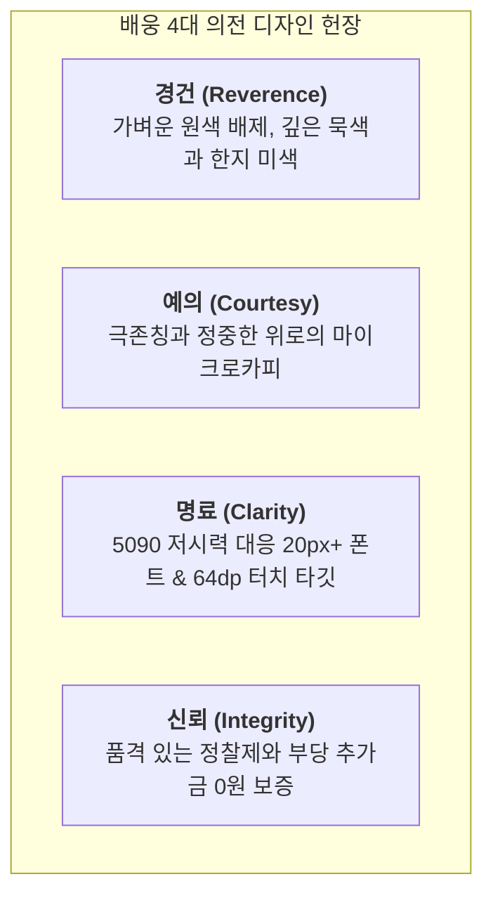

# 시니어 5090 세대를 위한 '경건(敬虔)과 예(禮)'의 디자인 시스템 명세서
문서 번호: AREA-DESIGN-2026-005  
상태: Approved (총괄 지휘자 강민석 박사 승인)  
시각 총괄: **조성우 수석 디자이너 (34년 경력, 한국전통시각디자인연구소장, 전 국립현대미술관·KCDF 자문)**  
주관: 한수진 박사 (시니어 인지공학 & HCI) & 이정환 박사 (장의학 & 전통 예법)  
참여: 배용태 박사 (정산 품격 감수), 최진호 박사 (진단기 UI 감수), 조은영 박사 (의전 품위 감수)

> **⚠ 부분 정복 통지 (2026-09-27)**
> 본 문서의 **4대 가치(경건·예의·명료·신뢰) · 경어체 · 마이크로카피 · 상업적 어투 배제 원칙은 전량 유효**하다.
> 그러나 **색상 수치(§2) · 폰트 크기(§3) · 터치 타깃(§4) 는 `design-token-canonical-2026.md` (AREA-DESIGN-2026-009) 로 정복되었다.**
> 특히 §2 의 `hanji #FAF8F5` · `celadon #2D4F43` · `cinnabar #A33B32` · `mutedInk #6C757D` 는 **해당 문서에 미기재되었던 WCAG AA 미달**로 판명되어 대체되었다. (mutedInk `#6C757D` = 4.30:1, 본문 기준 4.5:1 미달)

---

## 1. 배경 및 핵심 철학

장례는 생애 가장 깊은 슬픔과 마주하는 순간이며, SeeOut(배웅)의 주요 사용자는 **50대부터 90대까지의 고령 유족과 그 가족**이다.
따라서 본 플랫폼은 일반 상업적 IT 서비스의 가볍고 번쩍이는 디자인을 엄격히 배제하고, **선조들의 상장례 예법에 깃든 깊은 경건함과 정중한 위로, 품격 있는 단정함**을 최우선 가치로 삼는다.

---

## 2. 시니어 맞춤형 컬러 팔레트 (전통 한국적 미학)

| 색상 명칭 | HEX 코드 | 배색 의미 및 적용 영역 |
| :--- | :--- | :--- |
| **한지 미색 (Hanji Ivory)** | `#FAF8F5` | 기본 배경색. 차가운 백색 형광등 느낌을 배제하고 따뜻한 위안을 제공 |
| **백자 순백 (Porcelain White)**| `#FFFFFF` | 카드 및 주요 컴포넌트 배경. 정갈하고 깨끗한 여백 |
| **진먹색 (Deep Ink Charcoal)**| `#1F2226` | 기본 텍스트. 완전 검정(#000)보다 눈의 피로도가 적고 붓글씨의 묵직함 전달 |
| **단청 비취록 (Celadon Green)**| `#2D4F43` | 브랜드 시그니처 컬러. 가벼운 초록이 아닌 고려청자의 깊은 비취색으로 품격 표현 |
| **고려 황동금 (Noble Antique Gold)**| `#94784C` | 서브 강조 컬러. 예우와 품위를 상징하는 차분한 골드 |
| **애도 묵흑 (Mourning Slate)** | `#14171A` | 비상 모드 배경. 임종의 엄숙함과 터널 시야를 보듬는 묵념의 블랙 |
| **절제된 단홍 (Restrained Crimson)**| `#A33B32` | 비상 모드 핫라인. 쨍한 형광 빨강이 아닌, 전통 인주/단청의 묵직한 적갈색 |

---

## 3. 타이포그래피 및 인지공학 규격 (WCAG 2.1 AAA)

1. **글꼴 (Font Family)**:
   - 헤드라인 및 주요 타이틀: `Noto Serif KR`, `KoPubWorld Batang` (단정하고 기품 있는 명조체)
   - 본문 및 수치: `Pretendard`, `Noto Sans KR` (가독성이 극대화된 굵직한 산세리프)
2. **폰트 크기 및 행간**:
   - 최소 본문 크기: **18px ~ 20px** (노안 및 돋보기 착용 유족 고려)
   - 주요 헤드라인: **26px ~ 34px**
   - 줄 간격 (Line Height): **175% ~ 190%** (숨 쉴 수 있는 넉넉한 공간감)
3. **터치 인터랙션**:
   - 최소 터치 높이: **64dp 이상** (손떨림 보정)
   - 버튼 클릭 반경: 패딩 상하 18px 이상

---

## 4. 언어 및 UX 라이팅 (예의와 공경의 문체)

- **수정 전 (상업적 표현)**: "지금 임종하셨나요? 1초 긴급 출동 요청", "총 570만 원 절감됩니다!"
- **수정 후 (정중한 의전 표현)**: 
  - "고인의 마지막 가시는 길, 최고의 예우로 삼가 모시겠습니다."
  - "24시간 전담 장례지도사 즉시 출동 (가족의 곁을 정성껏 지키겠습니다)"
  - "유족의 슬픔을 이용한 부당한 거품을 걷어내고, 정직한 원가 정찰제로 모십니다."
  - "배웅 전환 시 예상 부담 차액: OOO만 원 (정직하고 투명한 실비 정산)"

---

## 5. 승인 서명
- **총괄 지휘자**: 강민석 박사 (Approved on 2026-09-26)  
- **시니어 인지공학 주관**: 한수진 박사 (Senior Usability Verified)  
- **전통 장례문화 주관**: 이정환 박사 (Etiquette & Dignity Audited)
