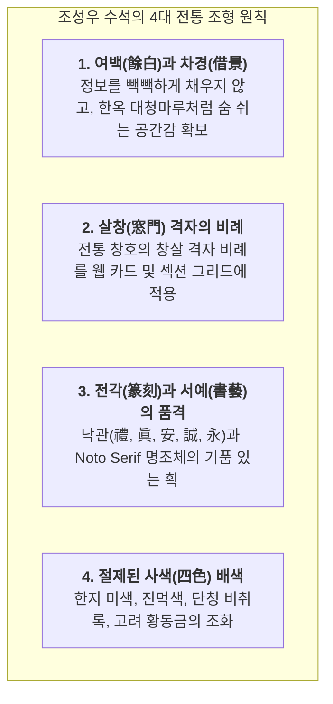

# 한국 전통 미학과 모던 미니멀리즘의 조화: 배웅 시각 정체성 설계 지침
문서 번호: AREA-DESIGN-2026-006  
주관: **조성우 수석 디자이너 (34년 경력, 전 국립현대미술관·KCDF 시각아이덴티티 총괄 자문, 한국전통공예·시각디자인연구소장)**  
참여: 한수진 박사 (시니어 인지공학), 이정환 박사 (장의학·전통의례), 강민석 박사 (총괄 아키텍트)  
참고 사이트 분석: 문화체육관광부 전통문화포털 (kculture.or.kr) 벤치마킹 및 배웅 독자 정체성 수립

---

## 1. 조성우 수석 디자이너의 디자인 총평 및 진단

> *"장례(葬禮)는 단순히 슬프고 어두운 의식이 아닙니다. 한 인간이 이 땅에서 일구어낸 고결한 삶을 온 가족과 사회가 가장 정중하게 기리는 '생애 마지막 봉헌의 예(禮)'입니다.*  
> *기존 상조 업계의 웹사이트들은 번쩍이는 금박과 자극적인 할인 문구로 도배되어 있거나, 반대로 지나치게 음산하고 무거운 분위기를 조성해 유족에게 불안감을 조성해 왔습니다.*  
> *배웅(SeeOut)은 전통문화포털(kculture.or.kr)이 보여주는 **한국 전통의 단아한 결(Texture)과 정갈한 여백의 미(美)**를 현대 웹 인터페이스로 재해석하되, 복고풍 흉내를 내는 것이 아니라 **최고급 백자와 한지, 단청의 비취록, 묵직한 먹빛이 어우러진 '모던 프리미엄 K-의전 에스테틱'**을 구축해야 합니다."*

---

## 2. 배웅 4대 전통 시각 조형 원칙

### 1) 여백과 차경 (Space & Breath)
- 어르신들이 정보를 마주할 때 시각적 압박감을 느끼지 않도록 섹션 간 패딩을 기존 대비 넉넉하게 확장 (py-12 ~ py-16).
- 텍스트 박스마다 숨 쉴 수 있는 내부 여백(Padding: 24px~32px)을 보장.

### 2) 살창 격자선 (Traditional Window Grille Line)
- 단순 회색 보더 대신, 한옥 창호지 문살의 단아함을 연상시키는 정갈한 미색 테두리 (`border-ink-border`, `#E3DFD7`)와 얇은 이중선(Double Line) 모티프 활용.
- 카드의 각 모서리에 은은한 귀접이(Corner Accent Bracket)를 적용하여 조선 왕실 의궤나 품격 있는 고서(古書)의 장정미를 부여.

### 3) 전각 낙관 인장 (Traditional Seal Stamps)
- 각 핵심 서비스에 상응하는 상징 한자 전각 낙관 배치:
  - 🏛️ 종합 의전: **`[禮]` (예도 례)** — 최고의 품격과 정중한 예우
  - 📋 견적 진단: **`[眞]` (참 진)** — 거짓과 거품 없는 투명한 실비
  - 🏥 장례식장: **`[安]` (편안할 안)** — 고인과 유족의 편안한 안식처
  - 📦 정찰 패키지: **`[誠]` (정성 성)** — 처음부터 끝까지 변함없는 정성
  - 📖 생애기록관: **`[永]` (길 영)** — 영원히 잊히지 않을 존엄한 기억

### 4) 전통 물성 배색 (Material Colors)
- **한지 미색 (`#FAF8F5`)**: 차가운 모니터 빛을 온화하게 감싸는 전통 닥종이의 따뜻한 베이지 아이보리.
- **진먹색 (`#1F2226`)**: 서예가가 정성껏 간 먹물의 묵직하고 깊은 흑색. 텍스트 가독성을 최상으로 유지.
- **단청 비취록 (`#243F35`, `#2D4F43`)**: 고려청자의 비취빛과 고궁 단청의 녹간(綠間)에서 추출한 품격 있는 딥 그린.
- **고려 황동금 (`#94784C`, `#C5A880`)**: 왕실 제기와 유기의 은은한 광채. 과하지 않은 고급스러움.
- **전통 인주홍 (`#A33B32`)**: 붉은 낙관 도장과 비상 모드에만 절제되어 사용되는 전통 주홍색.

---

## 3. UI 컴포넌트별 개선 상세 계획

1. **상단 글로벌 헤더 ([`Header.tsx`](file:///Users/ssh/Documents/Develope/SeeOut/src/web/components/Header.tsx))**:
   - 좌측 심볼에 단아한 붉은색 낙관 전각 `[禮]` 도장 그래픽 뱃지 정밀 적용.
   - 단청 비취록과 은은한 황동 금빛의 조화로운 테두리 라인.
2. **메인 홈 및 카테고리 카드 ([`NormalMode.tsx`](file:///Users/ssh/Documents/Develope/SeeOut/src/web/components/NormalMode.tsx))**:
   - 4대 서비스 카드에 전통 귀접이 모서리 라인 및 `[眞]`, `[安]`, `[誠]`, `[永]` 전각 심볼 각인.
   - 고화질 의전 사진 위에 은은한 한지 그라데이션 필터 적용으로 시각적 안정감 극대화.
3. **상조 견적 진단기 ([`QuoteDiagnosticsWidget.tsx`](file:///Users/ssh/Documents/Develope/SeeOut/src/web/components/QuoteDiagnosticsWidget.tsx))**:
   - 전통 서찰 및 의전 정산서 느낌의 정갈한 타이포그래피.
   - 컴플레인 없는 3단계 돈의 흐름 안내판에 단아한 한옥 창호 격자 테두리 부여.
4. **전역 스타일 ([`index.html`](file:///Users/ssh/Documents/Develope/SeeOut/index.html))**:
   - 전통 문양 띠선(`.k-traditional-divider`), 전각 인장 스타일(`.k-seal-stamp`), 고서 귀접이 장식 클래스 추가.

---

## 4. 자문 위원 승인
- **디자인 총괄**: 조성우 수석 디자이너 (한국전통시각디자인연구소장, 34년 경력)  
- **시니어 인지공학**: 한수진 박사  
- **전통의전 자문**: 이정환 박사  
- **기술 총괄**: 강민석 박사  
