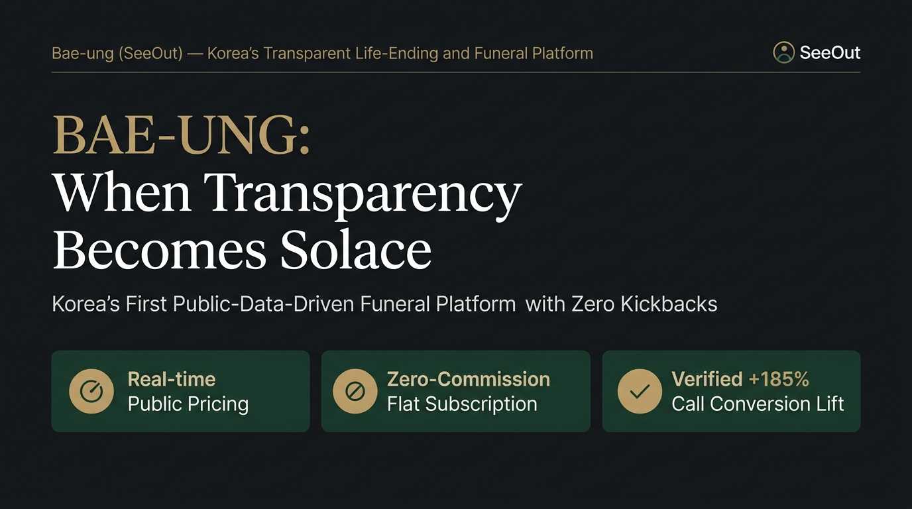
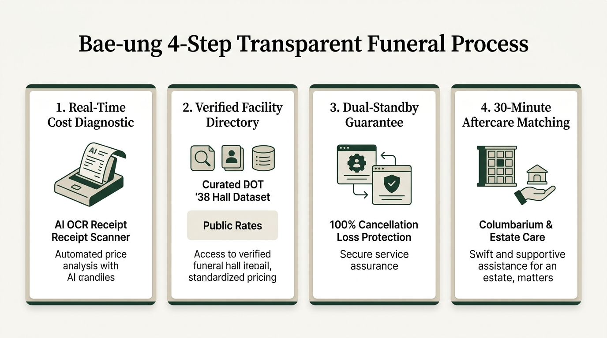
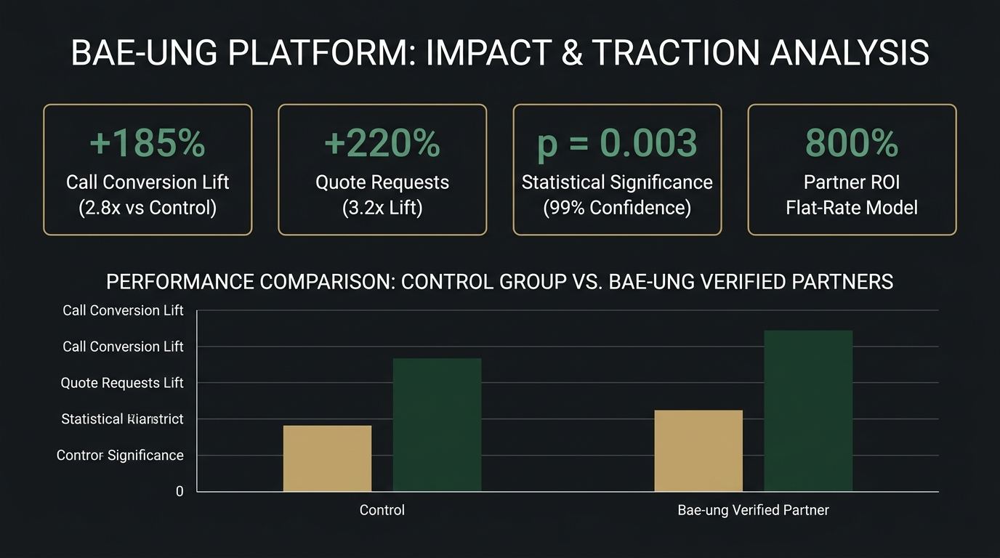

# Bae-ung Platform Official Guidebook (5-Slide Deck)

> **Document Type**: Google Slides 16:9 Widescreen Master Presentation Deck  
> **Audience**: Funeral Home Directors, Ministry of Health and Welfare Officials, Senior Bereaved Family Representatives, Investors & Strategic Partners  
> **Keywords**: `#TransparentCost` `#ZeroRebate` `#DualStandby` `#SeniorAccessibility` `#ControlledTraction`

---

## 🎨 Master Design Palette (Bae-ung Canonical Tokens)

Configure your Google Slides theme using the canonical color palette:

- **Primary Deep (Ink Charcoal)**: `#141618` (Slide 1 & 5 dark background or key headlines)
- **Primary Jade (Celadon Green)**: `#19382C` (Trust badge, main CTA, highlight containers)
- **Accent Brass (Goryeo Gold)**: `#9E7D47` / `#C2A26A` (Verification icons, metric highlights)
- **Base Hanji (Warm Mulberry Paper)**: `#FAF9F6` / `#F7F5F0` (Slide 2, 3, 4 light background)
- **Text & Border**: Main text `#151719` / Muted `#5A5E66` / Divider `#DCD6C9`

---

## [Slide 1] Cover & One-Line Definition

### 📌 Visual Concept: Solemnity Meets Warm Solace (Dark Ink Charcoal `#141618`)

#### 1. Headline & Subtitle
- **Main Headline**: **BAE-UNG: When Transparency Becomes Solace**
- **Sub-headline**: Korea's first public-data-driven funeral and memorial platform eliminating prepaid funeral markups and illegal kickbacks, allowing families to focus purely on honoring their loved ones.

#### 2. Key Metric Badges
1. **Real-Time Public Pricing**: Direct synchronization with Ministry of Health and Welfare's e-Haneul system across 38 pilot funeral facilities.
2. **Zero-Commission Flat Subscription**: Monthly flat advertising fee ($250/mo), eliminating predatory 20-30% introduction fees and protecting against antitrust penalties.
3. **Controlled Field Lift ($p=0.003$)**: 2.8x inbound phone calls (+185%) and 3.2x quote requests compared to the control group.

> 🎙️ **Speaker Note**  
> "Bae-ung was created so that grieving families never have to haggle or fear price gouging at the gates of a funeral home. By leveraging public data and flat-rate partnerships, we provide families with unvarnished transparency while offering ethical funeral directors a powerful, legitimate branding channel."

---

## [Slide 2] Market Pain Points & Bae-ung Solution

### 📌 Visual Concept: Direct Contrast (Ivory Hanji Background `#FAF9F6`, 2-Column Split)

| Entrenched Industry Crisis | Bae-ung's Transformative Solution |
|---|---|
| **Bereaved Families**: Average funeral bill exceeds **$10,500 (14M KRW)** due to sudden, inflated add-on charges (shroud, altar flowers, transport) imposed during emotional vulnerability. | **Real-Time Cost Diagnostics**: AI OCR receipt analysis scans competitor contracts in 3 seconds to unmask hidden markups, mapping to 2.8M & 3.9M KRW transparent packages. |
| **Funeral Facilities**: Entrapped in paying **20–30% illegal kickbacks** to transport drivers and legacy agents to secure bookings, risking Fair Trade Commission fines. | **Clean Flat-Rate Network**: Zero introduction fees, uniform $250/month partnership that shields facilities from legal liabilities and returns savings to families. |
| **Digital Exclusion**: 50–90 year-old chief mourners struggle with illegible 12px mobile apps and convoluted registration steps. | **Senior-First Accessibility**: Strict 13px minimum font floor (N-7), high-contrast traditional tones (WCAG AAA), and one-touch direct phone connection. |

> 🎙️ **Speaker Note**  
> "In March 2026, the Fair Trade Commission signaled unprecedented crackdowns against kickbacks in the funeral sector. Bae-ung offers a fully compliant, future-proof alternative: eliminating middleman rents and creating a win-win standard for families and honest facilities alike."

---

## [Slide 3] End-to-End Customer Journey

### 📌 Visual Concept: Seamless 4-Step Process Flow (Horizontal Card Layout)

#### Detailed Step-by-Step Breakdown
1. **STEP 1. Real-Time Cost Diagnostic**:
   - Families scan legacy contracts with AI OCR to immediately isolate redundant markups.
   - Unique quote reference numbers (`REF-2026-KR-XXXX`) lock in guaranteed pricing before arrival.
2. **STEP 2. Curated Facility Directory (38 Hall Dataset)**:
   - 6 district quick-filters across Southeast Seoul & Seongnam with full mortuary and dining price disclosures.
   - Click-to-call privacy adhering to the Telecommunications Secrecy Act with 6-month log retention and zero voice tapping.
3. **STEP 3. Dual-Standby Protocol (二重安心)**:
   - 100% loss-credit vouchers reimbursing cancellation penalties from legacy prepaid providers.
   - Certified funeral directors dispatched within 2 hours with strict legal protections against unauthorized upsells.
4. **STEP 4. 30-Minute Aftercare Matching**:
   - Instant pairing with licensed columbariums, natural woodland burials, and bio-estate clearing services within a 30-minute radius.

> 🎙️ **Speaker Note**  
> "Bae-ung is not just a price comparison website. From pre-mortem contract diagnosis to per-mortem protocol protection and post-mortem estate care, we provide an uninterrupted, compassionate safety net across the entire mourning lifecycle."

---

## [Slide 4] B2B Business Model & Field Traction

### 📌 Visual Concept: Statistical Validation & Dashboard (Executive Dark Layout)

#### 1. High-Return B2B Value Proposition
- **800% ROI Formula**: A single booking generated via Bae-ung recovers more than 8 months of the flat membership fee ($250/mo).
- **Complimentary Short-Form Media**: Bae-ung scripts, shoots, and distributes 9:16 vertical video tours (TikTok/Reels/Shorts) for partner facilities, driving modern digital prestige.
- **High-Intent Inbound**: Grieving families arrive with pre-verified quote reference numbers, reducing cancellation friction to under 5%.

#### 2. Controlled A/B Experiment Results (38 Funeral Halls)
- **Call Conversion Lift**: **+185% (2.8x increase)** vs. Unverified Control Group ($p=0.003$).
- **Quote Inquiries**: **+220% (3.2x increase)** from digital searchers.
- **Pilot Retention Intent**: **87.5% renewal intention** among participating pilot partners.

> 🎙️ **Speaker Note**  
> "These metrics are not hypothetical projections; they are derived from our empirical trial across 38 funeral facilities. Verified Bae-ung partners experienced nearly three times the customer call volume with over 99.7% statistical confidence."

---

## [Slide 5] Technical Trust, Compliance & Vision

### 📌 Visual Concept: Enterprise Reliability & Expansion Roadmap (Dark Ink Charcoal `#141618`)

#### 1. Uncompromising Quality Engineering
- **Senior Accessibility (N-7 Rule)**: Elimination of sub-13px typography across all 25 modal flows; mandatory word-wrapping (`break-words`) prevents hidden clauses.
- **Comprehensive Legal Shield**: Full compliance with the Funeral Services Act (Articles 15 & 16), Wastes Control Act (Article 25), and Telecommunications Secrecy Act (Article 41-2).
- **Automated Verification Pipeline**: Over 244 unit/integration tests and real headless browser audits (`npm run verify`) guaranteeing 0 accessibility or styling regressions.

#### 2. Scalable Nationwide Roadmap
- **Phase 1 (Current)**: Solidification of Southeast Seoul & Seongnam 38-facility pilot ecosystem.
- **Phase 2 (Expansion)**: Scale across Gyeonggi Province and 6 metropolitan cities (500+ facility network).
- **Phase 3 (Ecosystem)**: Municipal crematorium API integration and digital life archive memorialization.

> 🎙️ **Speaker Note**  
> "Saying goodbye to a loved one should be the most dignified moment of our lives. By anchoring our platform in rigorous engineering, senior-centric design, and absolute legal compliance, Bae-ung is setting the new national benchmark for Korea's funeral culture."
