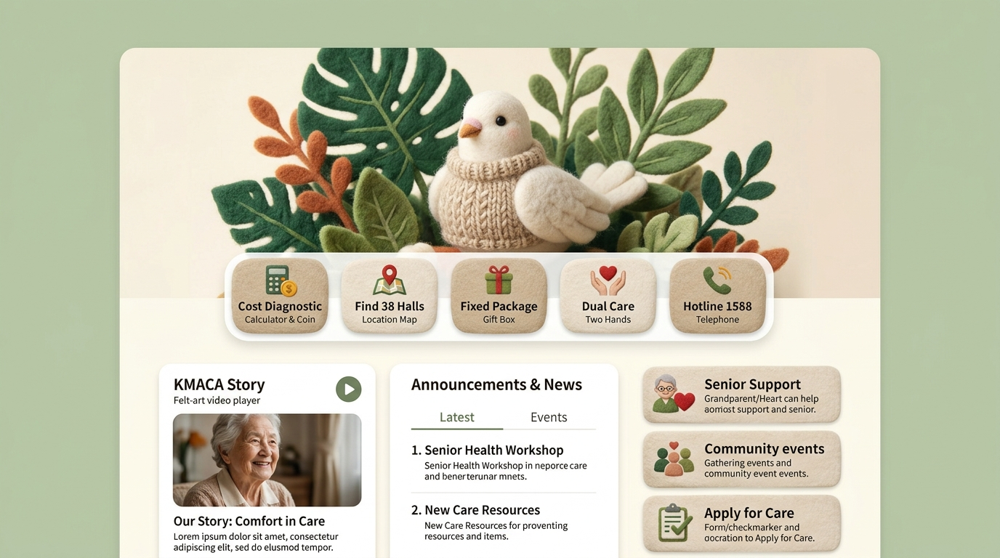
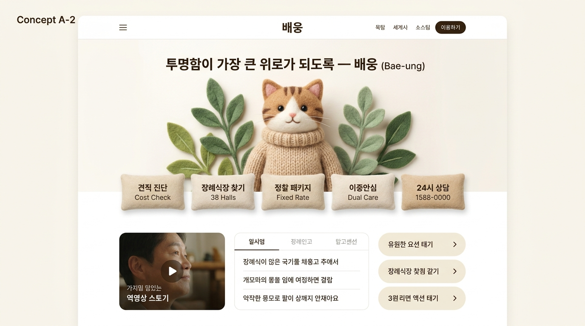
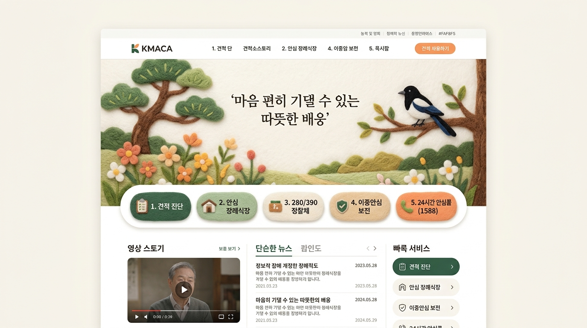

# 배웅(Bae-ung) [A안 기반] 니들 펠트 공예 감성 결합 디자인 시안 3종

> **디자인 기획 요약**: 사용자가 선택한 **[시안 A: KMACA 퀵 메뉴 & 3열 분할 구조]**에, 핀터레스트 레퍼런스(`Needle Felting / Knitted Wool / Organic Botanical Leaves`)의 **포근한 양모 니트 질감과 세이지 그린 & 오트밀 크림 배색**을 결합한 3가지 신규 발전 시안입니다.

---

## 🧶 핀터레스트 레퍼런스 차용 핵심 분석

1. **소재감 (Tactile Texture)**:
   - 차갑고 평면적인 벡터 아이콘이나 스톡 인물 사진 대신, **손으로 직접 뜬 포근한 양모 펠트(Needle Felting)와 스웨터 니트 질감** 도입.
   - 장례라는 무거운 주제에서 오는 불안감과 거부감을 **만지고 싶은 포근한 온기(Cozy Solace)**로 치환.
2. **컬러 팔레트 (Nature & Comfort)**:
   - **세이지 그린 (Sage Green, 차분한 단청 비취록)**: 눈이 편안하고 마음에 안정을 주는 식물성 자연 녹색.
   - **오트밀 크림 (Oatmeal Cream, 부드러운 한지 미색)**: 따스한 실내 조명과 같은 포근한 바탕.
   - **테라코타 앰버 (Terracotta Amber, 은은한 고려 황동)**: 생동감을 주는 따뜻한 주황빛 포인트.
3. **콘텐츠 구조 (KMACA식 텍스트 70% 축소)**:
   - 상단 펠트 헤로 비주얼 + 중앙 **도톰한 펠트 쿠션 5대 퀵 버튼 바** + 하단 **3열 분할 정보 타일**.

---

## 🎨 신규 발전 시안 3종 미리보기 및 비교

---

### [시안 A-1] 포근한 펠트 버드 & 보태니컬 KMACA형 (Cozy Felt Bird & Botanical)

#### 1. 비주얼 및 컴포넌트 구성
- **헤로 아트워크**: 니트 스웨터를 입은 순백의 양모 펠트 평화의 새(비둘기/파랑새 마스코트)와 부드러운 펠트 몬스테라 잎 프레임.
- **플로팅 퀵 버튼 5선**: 도톰한 펠트 천 질감의 쿠션 버튼 (`Cost Diagnostic`, `Find 38 Halls`, `Fixed Package`, `Dual Care`, `Hotline 1588`).
- **하단 3열 그리드**:
  - 좌측: 숏폼 랜선투어 영상 스토리 타일
  - 중앙: 간결한 2탭 공지사항 (텍스트 최소화)
  - 우측: 펠트 일러스트가 들어간 3대 시니어 안심 서비스 타일

#### 2. 장점
- "고인을 평안한 곳으로 배웅하는 날갯짓"이라는 플랫폼의 정체성과 가장 부합하며, 병원이나 공공기관 사이트보다 훨씬 더 다정하고 따뜻한 위안을 전달합니다.

---

### [시안 A-2] 니트 스웨터 펠트 캣 & 한글 타이포그래피형 (Needle-Felt Cat Comfort) ⭐ 강력 추천

#### 1. 비주얼 및 컴포넌트 구성
- **헤로 아트워크**: 핀터레스트 원작의 정서를 그대로 담은 **따스한 니트 스웨터를 입은 양모 펠트 고양이 캐릭터와 싱그러운 세이지 그린 나뭇잎**.
- **한글 타이포그래피**: 상단에 배웅의 대표 슬로건 **"투명함이 가장 큰 위로가 되도록 — 배웅 (Bae-ung)"**을 단정하게 배치.
- **플로팅 퀵 쿠션 바 5선 (한글화)**:
  - 📊 **견적 진단** (Cost Check)
  - 🏛️ **장례식장 찾기** (38 Halls)
  - 📦 **정찰 패키지** (Fixed Rate)
  - 🛡️ **이중안심** (Dual Care)
  - 📞 **24시 상담 1588-0000**
- **하단 3열 구조**: 영상 스토리 + 일시/장례 안내 탭 + 유연한 퀵 액션 타일.

#### 2. 장점
- 핀터레스트 원작의 사랑스럽고 무장해제되는 감성이 100% 반영되어, 상벌과 슬픔에 지친 유족의 마음을 1초 만에 어루만져 주는 가장 독보적이고 인간적인 시안입니다.

---

### [시안 A-3] 한국 전통 정원 & 헤리티지 펠트 자수형 (Korean Heritage Felt Landscape)

#### 1. 비주얼 및 컴포넌트 구성
- **헤로 아트워크**: 부드러운 소나무, 들꽃, 나뭇가지에 앉은 까치가 어우러진 한국적 정원의 따뜻한 니들 펠트 풍경화.
- **슬로건**: **"마음 편히 기댈 수 있는 따뜻한 배웅"**
- **플로팅 퀵 버튼 5선**:
  - `1. 견적 진단` · `2. 안심 장례식장` · `3. 280/390 정찰제` · `4. 이중안심 보전` · `5. 24시간 안심콜(1588)`
- **하단 3열 그리드**: 따뜻한 영상 스토리 + 단순한 뉴스 탭 + 빠른 서비스 바로가기 4타일.

#### 2. 장점
- 배웅의 한국 전통 미학(소나무, 까치, 한지)과 펠트 공예가 조화를 이루어, 60~80대 시니어 유족과 보수적인 장례식장 원장님들께도 격조 높고 거부감 없는 편안함을 제공합니다.

---

## 📊 시안 3종 비교표

| 항목 | [시안 A-1] 펠트 버드 & 보태니컬 | [시안 A-2] 펠트 캣 & 한글 타이포 (추천) | [시안 A-3] 전통 정원 펠트 자수 |
|---|---|---|---|
| **대표 오브젝트** | 니트 스웨터 하얀 새 & 몬스테라 | 니트 스웨터 고양이 & 세이지 잎 | 소나무, 까치, 들꽃 풍경 자수 |
| **정서적 메시지** | "평온한 하늘로의 배웅과 위안" | **"지친 마음을 보듬는 따스한 온기"** | "마음 편히 기댈 수 있는 쉼터" |
| **KMACA 퀵 버튼** | 도톰한 펠트 텍스처 5버튼 | **부드러운 한글 쿠션 5버튼** | 번호가 매겨진 명료한 5버튼 |
| **타깃 감수성** | 30~50대 가족 및 감성 유족 | **전 연령층 (특히 심리적 안정 필요)** | 50~80대 전통 시니어 친화적 |
