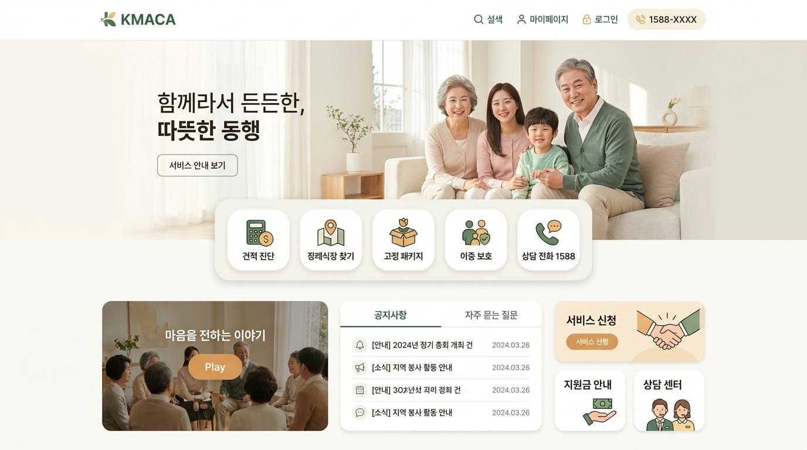
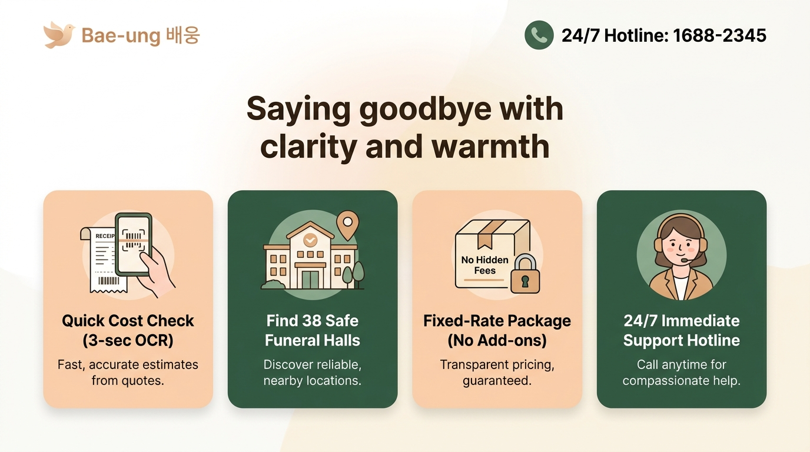
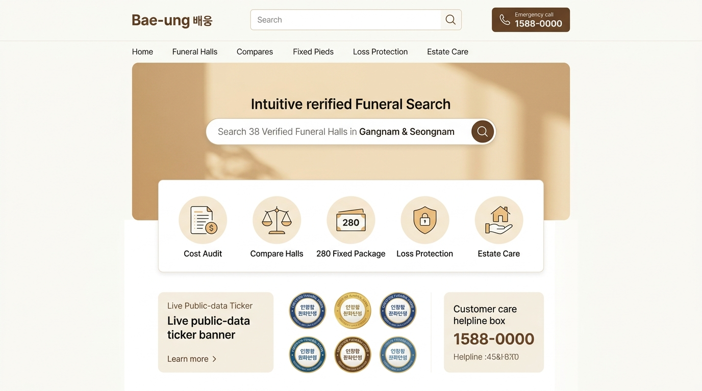

# 배웅(Bae-ung) 웹사이트 밝고 따뜻한 디자인 개편 제안서 (KMACA 구조 차용)

> **기획 배경**: 기존의 어둡고 무거운 묵흑 톤과 텍스트 위주의 빽빽한 화면 구조에서 탈피하여, **한국상조공제조합(KMACA)의 밝고 편안한 포털 구조를 차용**하고 **텍스트를 70% 이상 대폭 축소**한 3가지 신규 디자인 시안을 제안합니다.

---

## 💡 개편 핵심 방향 (Design Principles)

1. **톤앤매너 전환 (어두운 침울함 ➔ 밝고 따뜻한 안도감)**:
   - 묵흑(블랙) 위주의 어두운 기조에서 **따뜻한 크림/아이보리(#FAF9F6, #FFFDF9) 베이스**와 **포근한 세이지 그린(#2D5A46), 소프트 피치 앰버(#D4A373)**로 전면 전환.
   - 유족이 사이트에 들어왔을 때 공포나 슬픔 대신 "마음 편히 기댈 수 있는 따뜻한 쉼터"의 느낌을 제공.
2. **콘텐츠 다이어트 (장문 산문 ➔ 직관적 대형 퀵 아이콘 & 카드)**:
   - 장황한 문장 설명을 걷어내고, **2~3글자의 명확한 퀵 아이콘 바**와 **직관적인 비주얼 카드 블록**으로 재배치.
   - 읽지 않고도 "어디를 누르면 무엇이 해결되는지" 1초 만에 인지 가능.
3. **KMACA(한국상조공제조합) 핵심 성공 요소의 영리한 차용**:
   - 상단 따뜻한 가족/채광 비주얼 배너
   - 메인 비주얼과 본문을 연결하는 플로팅 퀵 메뉴 스트립
   - 3열 분할 미디어/공지/원클릭 서비스 타일 그리드
   - 큼직하고 든든한 24시간 상담 핫라인 전화번호 강조

---

## 🎨 디자인 시안 3종 비교 및 미리보기

---

### [시안 A] 따뜻한 가족 동행 & KMACA 정통 계승형 (추천 ⭐)

#### 1. 레이아웃 및 비주얼 구성
- **상단 비주얼**: 은은한 자연광 속에서 미소를 짓고 있는 3대 가족의 따뜻한 사진과 감성 슬로건 ("함께라서 든든한, 따뜻한 동행").
- **중앙 플로팅 퀵 아이콘 (5구)**:
  - 📊 **견적 진단**: 타사 견적서 3초 OCR 판독
  - 🏛️ **장례식장 찾기**: 강남4구·성남 38곳 실시간 공시가
  - 📦 **고정 패키지**: 280/390 무추가금 정찰제
  - 🛡️ **이중 보호**: 상조 해약 위약금 100% 보전
  - 📞 **상담 전화 1588**: 원터치 즉시 통화
- **하단 3열 정보 블록**:
  - 좌측: 숏폼 랜선투어 미디어 플레이어 ("마음을 전하는 이야기")
  - 중앙: 간결한 2탭 공지/자주 묻는 질문 (제목과 날짜만 깔끔 노출)
  - 우측: 원클릭 서비스 신청 타일 3구 (서비스 신청, 지원금 안내, 상담 센터)

#### 2. 장점
- KMACA의 공식적이면서도 정돈된 공공 포털 느낌을 가장 자연스럽게 녹여내어, 유족과 장례식장 원장님 모두에게 가장 높은 신뢰감을 전달합니다.

---

### [시안 B] 극단적 미니멀 & 원터치 빅카드형 (Mobile/Senior 친화형)

#### 1. 레이아웃 및 비주얼 구성
- **글자 수 80% 압축**: 긴 설명문을 완전히 제거하고, 헤드라인 한 줄("Saying goodbye with clarity and warmth / 투명함이 가장 큰 위로가 되도록")만 배치.
- **4대 대형 인터랙티브 카드 (Big Touch Cards)**:
  1. 📄 **3초 견적 진단**: 영수증 스캔 일러스트 + 즉시 진단 버튼
  2. 🏛️ **안심 장례식장 38곳**: 위치 핀 일러스트 + 주변 시설 검색
  3. 📦 **추가금 없는 정찰 패키지**: 자물쇠/택배 일러스트 + 100% 정찰 보증
  4. 🎧 **24시간 안심 출동 핫라인**: 친근한 상담원 일러스트 + 직통 연결
- **상단 헤더**: 거대한 폰트의 직통 전화번호 (`24/7 Hotline: 1688-XXXX`)를 항상 고정 노출.

#### 2. 장점
- 노안 유족(50~80세)이나 경황없는 모바일 사용자가 스크롤을 내릴 필요도 없이, 4개의 큰 버튼 중 원하는 것을 바로 터치할 수 있는 극강의 편의성을 자랑합니다.

---

### [시안 C] 공공 신뢰 포털 & 스마트 원스톱 검색형 (Search & Verified Directory)

#### 1. 레이아웃 및 비주얼 구성
- **상단 통합 검색창**: 메인 배너 중앙에 네이버/구글 스타일의 큼직한 검색창 배치 ("강남4구·성남 38개소 실시간 공시비용 검색").
- **가로형 원형 퀵 링크 스트립 (5종)**:
  - 원가 감사 · 시설 비교 · 280 패키지 · 손실 보전 · 유품정리 케어
- **하단 신뢰 지표 & 제휴 배지 그리드**:
  - e하늘 실시간 공시 데이터 티커 (실시간 업데이트 알림)
  - 배웅 인증 6대 장례식장 금박 인증 마크 롤링 그리드
  - 24시간 긴급 안심 케어 박스 (`1588-0000`)

#### 2. 장점
- '공공데이터 기반 정찰 플랫폼'이라는 전문성과 공신력이 가장 돋보이며, 원하는 지역이나 시설을 즉시 검색해서 찾고자 하는 목적 지향적 사용자에게 매우 유용합니다.

---

## 📊 시안별 핵심 비교 요약표

| 비교 항목 | [시안 A] 따뜻한 가족 동행형 (추천) | [시안 B] 원터치 빅카드형 | [시안 C] 공공 신뢰 포털형 |
|---|---|---|---|
| **기본 콘셉트** | KMACA 정통 구조 + 따뜻한 온기 | 극단적 간결화 + 시니어 특화 | 공공 포털 검색 + 인증 권위 |
| **배경 및 메인 컬러** | 소프트 크림 & 세이지 그린 | 웜 아이보리 & 피치 베이지 | 맑은 한지 베이지 & 황동 골드 |
| **텍스트 분량** | 적음 (핵심 키워드 + 3열 타일) | **최소 (카드 4개 단어 위주)** | 보통 (검색창 + 실시간 티커) |
| **모바일 직관성** | 상 (KMACA 모바일 표준) | **최상 (대형 원터치 버튼)** | 상 (검색 위주) |
| **추천 시나리오** | **전 연령층에게 편안하고 신뢰감 있는 첫인상 전달** | **5070 상주가 긴급하고 빠르게 쓸 때** | **공공 공시 데이터와 지역 검색을 강조할 때** |

---

## 🛠️ 실제 화면 적용 방법

현재 코드베이스의 `NormalMode.tsx`와 컴포넌트들을 위 **시안 A(또는 선택하시는 시안)**의 밝고 따뜻한 톤으로 리팩토링할 수 있습니다:
1. `bg-[#0D0E10]` 묵흑 바탕 ➔ **따뜻한 크림 한지(`bg-[#FAF9F6]` 또는 `bg-[#FFFDF9]`)**로 전환
2. 상단 길게 나열되던 설명 섹션 ➔ **KMACA식 플로팅 퀵 아이콘 바**로 압축
3. 기존 위젯들의 긴 산문 ➔ **간결한 3열 비주얼 카드**로 슬림화
